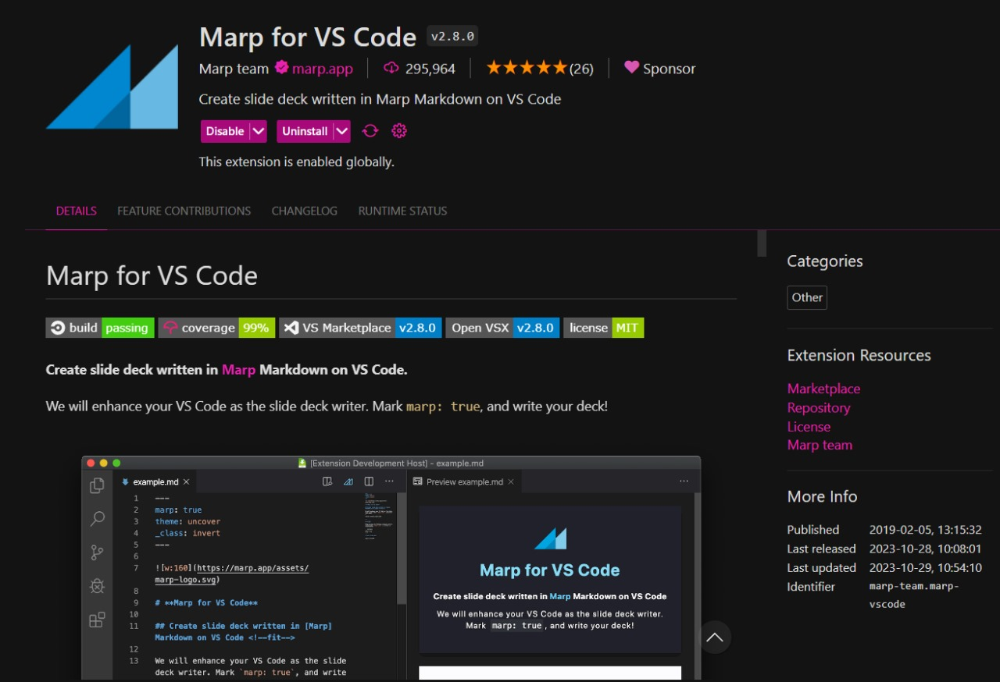
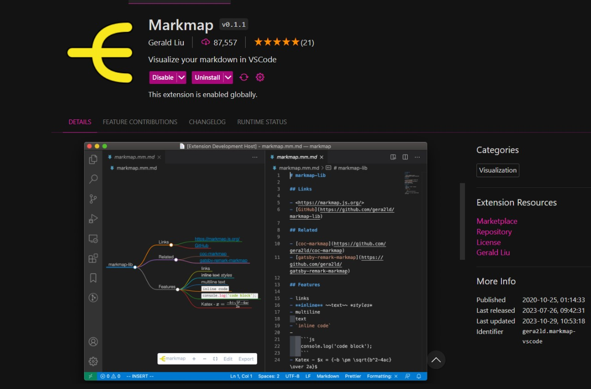
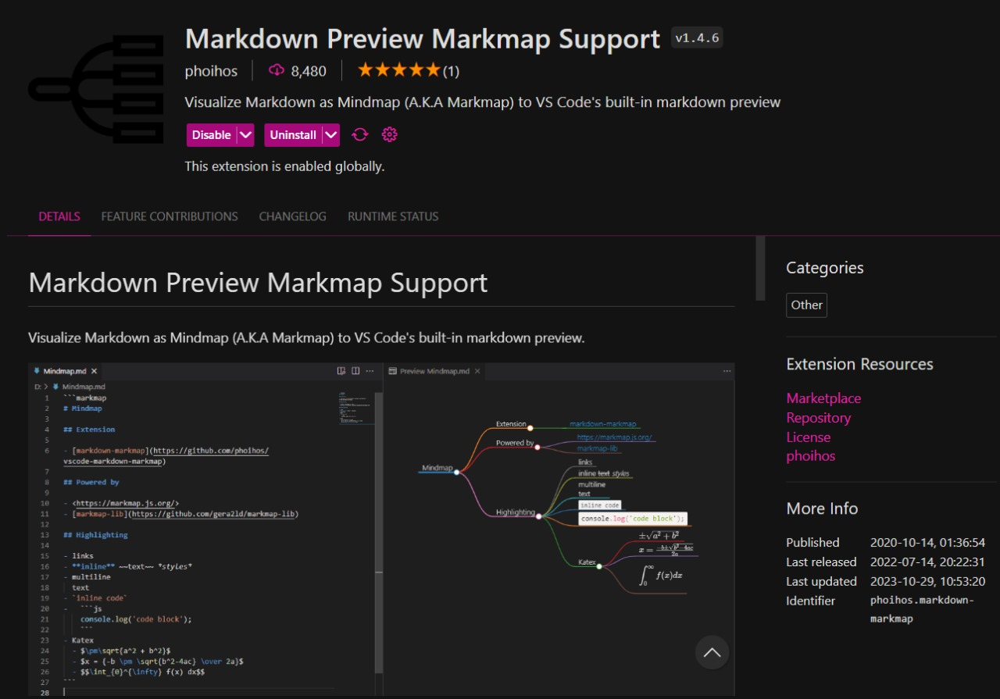
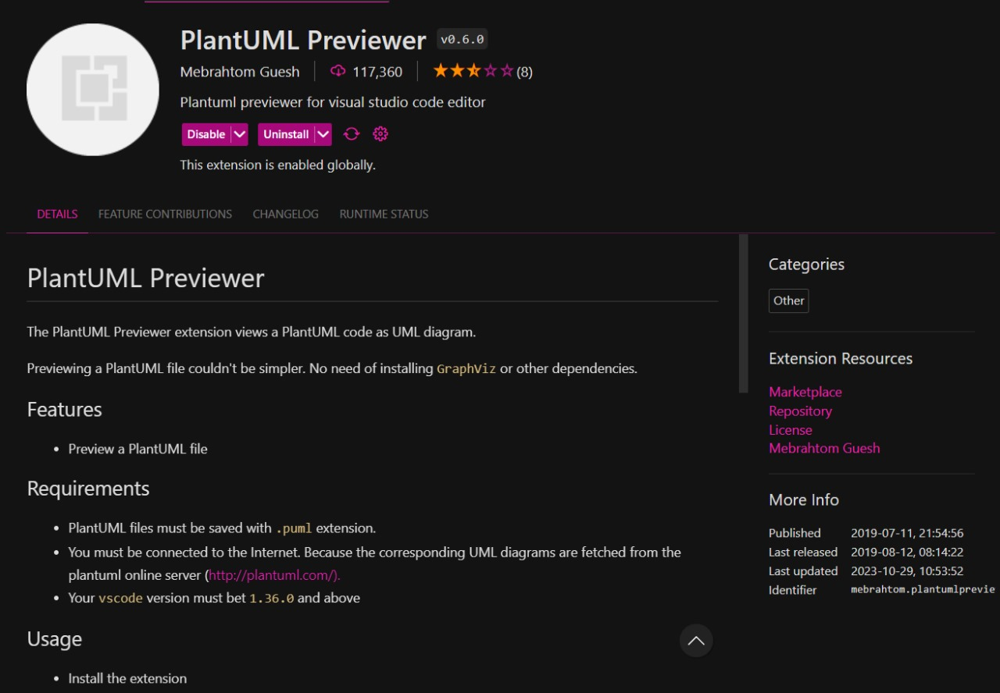
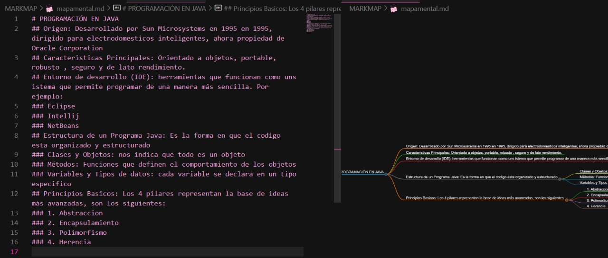
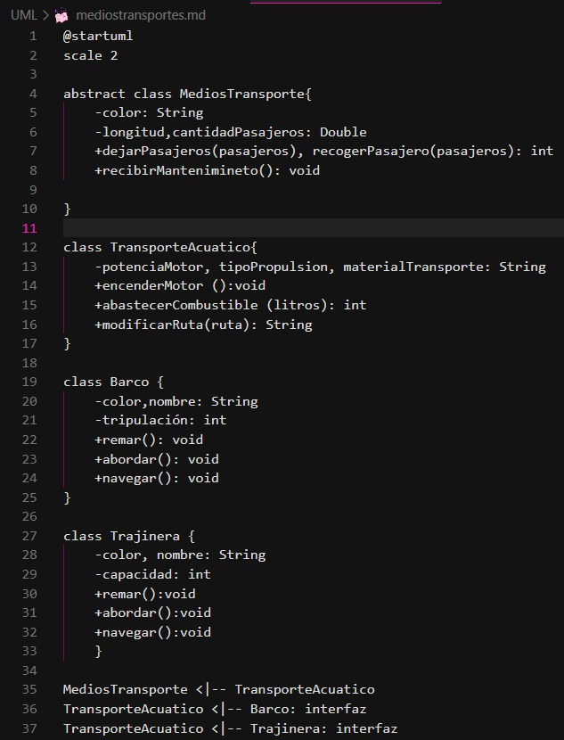
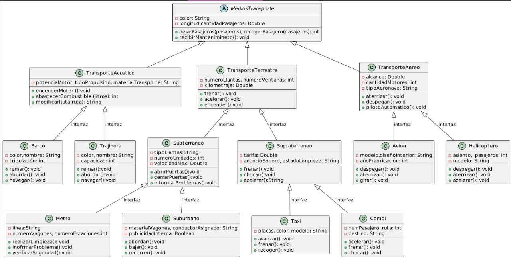

# **BIENVENIDOS AL TUTORIAL DE LAS TRES HERRAMIENTAS USANDO MARP**
Primero hay que tener descargado Visual Studio Code. Posteriormente descargar extensiones: 
- Marp for VS Code
- Markmap
- PlantUML Previewer 
Despues tenemos que definir elementos al iniciar:
- marp: true
- author: la persona que hará la presentación
- size: se pondrá una medida general 4:0 para que se ajuste el tamaño
- theme: se recomiendo usar "gaia" 
----
- Hay que descagar Marp for VS Code:         

Es utilizado para escribir presentaciones en formato Markdown. 
- Despues descargar Markmap: nos ayuda a generar mapas mentales de manera muy rapida.
 
- Y por ultimo descarga PlantUML Previewer: nos ayuda a crear diagramas UML apartir de texto plano. 

---
# MAPA MENTAL CON MARKMAP
Para realizar un mapa mental desde VSC, hacemos uso de MARMAP . Escrbiendo la idea principal con #, las ramas son escritas con ## y las subramas ###. 

Podemos ver el avancé con ayuda de la vista previa que se encuentra en la parte superior derecha y posteriormente exportarlo con extensión HTML. 

---
# REALIZACIÓN DE DIAPOSITIVAS CON MARP  
Antes que nada se deben definir aspectos predeterminados para el diseño de la presentación por ejemplo: 
- marp: true
- author: Quien lo realicé 
- size: 4:3
- theme: gaia 
- backgroundImage: url('https://img.freepik.com/psd-premium/
fondo-blanco-minimo-psd-fondo-escritorio-horizontal-neutral
-suave-fondo-panoramico-4k_691560-15.jpg') 
En esta presentación se opto por cambiar el fondo agregando al ulitma linea que se presenta anteriormente 

---
## REGLAS BASICAS
Para definir tititulos en MARP, es una manera muy sencilla de hacerl, es definir # conforme el tamaño del titulo: 
- # Titulo 1
- ## Titulo 2
- ### Titulo 3
- #### Titulo 4 
- ##### Titulo 5

---

Depende del tamaño que necesitemos para nuestra presentación.
Tambien hay diseños de texto que le podemos aplicar , por ejemplo: 
  - **negrita**
  - *italica* 
  - ~~tachado~~
  - `codigo` 
Podemos realizar tablas de la siguiente manera:
### Tabla 
|Titulo 1|Titulo2|
|---|---|
|celda 1|celda2|
---
# REALIZACIÓN DE DIAGRAMAS EN BASE A UN CODIGO CON UML
Tienes que crear una carpeta y posteriormente dentro de ella crear un archivo de texto usando UML, ene ste ejemplo implementamos el codigo de mediostransporte y definiendo cada clase con su respectiva interfaz. Posteriormente ve a la pestaña *view* y presiona *command palette* y pon en el buscador *preview currente PlantUML* para que te mande a una pestaña con el diagrama en bloques.  
 

---
Queda de la siguiente forma, observamos como se definen los atributos, métodos y el nombre de la clase , indicando con las flechas la clase que hereda :

